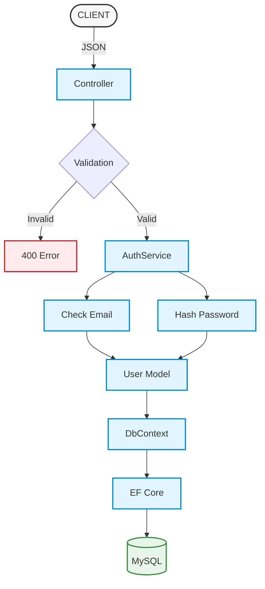

# Request Flow Architecture :

```mermaid
graph TD
    %% Define Styles
    classDef client fill:#f9f9f9,stroke:#333,stroke-width:2px;
    classDef component fill:#e1f5fe,stroke:#0288d1,stroke-width:2px;
    classDef database fill:#e8f5e9,stroke:#388e3c,stroke-width:2px;
    classDef error fill:#ffebee,stroke:#c62828,stroke-width:2px;

    %% Nodes
    Client([CLIENT]):::client
    Controller[Controller]:::component
    Validation{Validation}
    Error400[400 Error]:::error
    AuthService[AuthService]:::component
    CheckEmail[Check Email]:::component
    HashPassword[Hash Password]:::component
    User[User Model]:::component
    DbContext[DbContext]:::component
    EFCore[EF Core]:::component
    MySQL[(MySQL)]:::database

    %% Flows
    Client -->|JSON| Controller
    Controller --> Validation
    
    Validation -->|Invalid| Error400
    Validation -->|Valid| AuthService
    
    AuthService --> CheckEmail
    AuthService --> HashPassword
    
    CheckEmail --> User
    HashPassword --> User
    
    User --> DbContext
    DbContext --> EFCore
    EFCore --> MySQL
```
